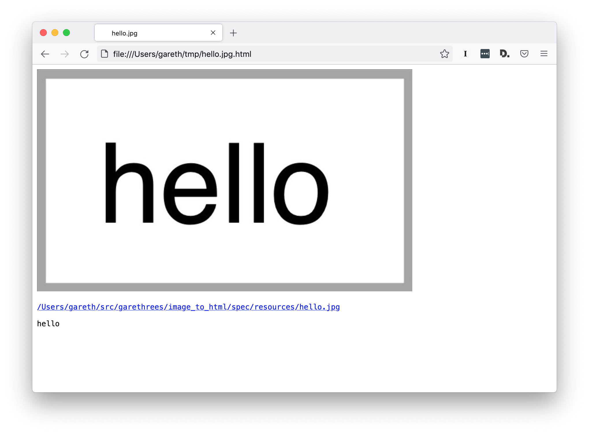

# ImageToHTML

CLI tool to OCR an image and output HTML containing the image and its extracted
text.

```sh
$ image-to-html hello.jpg > ~/tmp/hello.jpg.html
```



## Installation

This program must be compiled from source.

Prerequisites:

* A working [Crystal](https://crystal-lang.org/install/) compiler is needed.
* The [`tesseract`](https://tesseract-ocr.github.io/tessdoc/Installation.html)
  binary must be available in your `PATH`.

1. Clone this git repo:

```sh
$ git clone git@github.com:garethrees/image_to_html.git
```

2. To build a binary:

```sh
$ make bin/image-to-html
```

3. To use as a library, add the dependency to your `shard.yml`:

```yaml
dependencies:
  image_to_html:
    github: garethrees/image_to_html
```

4. Run `shards install`

## Usage

As a binary:

```sh
# Print the HTML to stdout
$ bin/image-to-html /path/to/image.jpg

# You can redirect stdout to create a HTML file
$ bin/image-to-html /path/to/image.jpg > image.jpg.html
```

As a library:

```crystal
# Just generate the HTML
html = ImageToHtml.run("/path/to/image.jpg")

# Or build it up yourself
html = ImageToHtml::Html.new(
  ImageToHtml::Image.new(
    Path["/path/to/image.jpg"]
  )
).to_s
```

## Contributing

1. Fork it (<https://github.com/garethrees/image_to_html/fork>)
2. Create your feature branch (`git checkout -b my-new-feature`)
3. Make sure the tests pass (`make test`)
4. Commit your changes (`git commit -am 'Add some feature'`)
5. Push to the branch (`git push origin my-new-feature`)
6. Create a new Pull Request

## Contributors

- [Gareth Rees](https://github.com/garethrees) - creator and maintainer

## Credits

- [Screenotate](https://screenotate.com/) for the inspiration
- [dannnylo/tesseract-ocr-crystal](https://github.com/dannnylo/tesseract-ocr-crystal) for the OCR integration
- [ylansegal/franklin.cr](https://github.com/ylansegal/franklin.cr) for the `Makefile`
